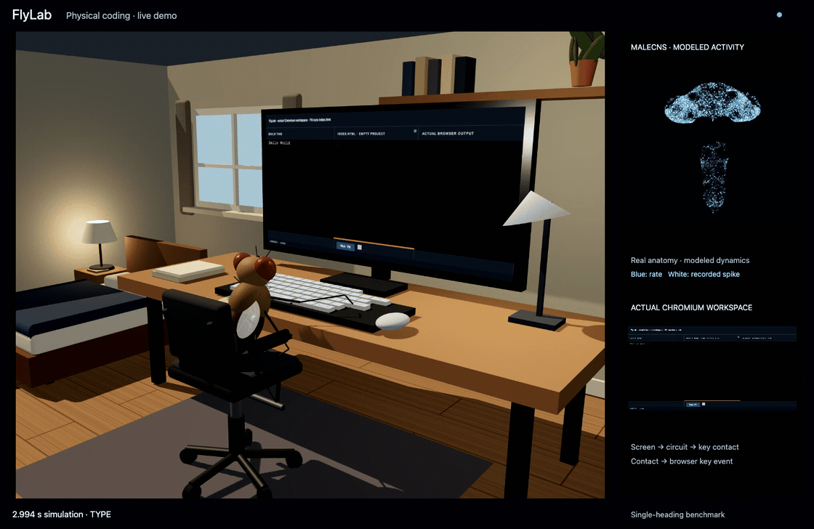
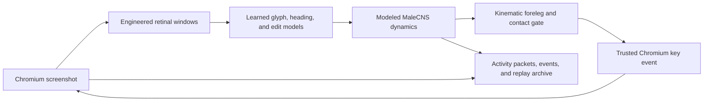

# FlyLab

[](https://github.com/Sudharsanselvaraj/The-Hawking-Fly/actions/workflows/verify.yml)
[](LICENSE)

FlyLab is an open-source research prototype for a bounded physical-coding experiment. A learned controller receives real Chromium screenshots, drives a kinematic fly foreleg to a physical keyboard, and records the resulting native browser input alongside a synchronized MaleCNS-inspired simulation and anatomy viewer.

<p align="center">
  <a href="docs/assets/flylab-demo.mp4">
    
  </a>
</p>
<p align="center">
  <a href="docs/assets/flylab-demo.mp4"><strong>Watch the full-quality demo (MP4)</strong></a><br />
  <sub>Actual full-CNS coding run · GIF plays at 2× speed · modeled neural activity</sub>
</p>

## What FlyLab demonstrates

- A contact-gated path from screenshot → learned controller → foreleg motion → native Chromium key event → new screenshot.
- A 3D workroom with a seated fly, physical keyboard, actual Chromium monitor pixels, and a live MaleCNS instrument.
- Whole-CNS anatomy and activity views using **176,422 cached MaleCNS neuron records** and **25,862,574 directed connections** in the full runtime.
- Recorded sessions with source-to-contact timing, screenshots, decisions, neural packets, and replay artifacts.

The active benchmark is intentionally narrow: single-line HTML headings, a fixed visual layout, and a learned controller evaluated on word recombination. It is not a general coding agent, a claim of biological programming ability, or a validated electrophysiological reconstruction. See [research status](#research-status) before citing or extending the results.

## Quick start

### Prerequisites

- Python 3.11+
- Node.js 22+
- Chromium installed through Playwright
- Cached FlyLab artifacts and data prepared as described in [Data and reproducibility](#data-and-reproducibility)

```sh
git clone https://github.com/Sudharsanselvaraj/The-Hawking-Fly.git flylab
cd flylab

python3.11 -m venv .venv
.venv/bin/python -m pip install --upgrade pip
.venv/bin/python -m pip install -e 'services/sim-engine[dev]'
.venv/bin/python -m playwright install chromium

npm --prefix web/app ci
PYTHONPATH=services/sim-engine .venv/bin/python -m uvicorn hawking_fly.api.app:app --host 127.0.0.1 --port 8050
```

In a second terminal:

```sh
npm --prefix web/app run demo
```

Open <http://localhost:5173>. Start runs the heading benchmark. **Brain** opens the whole-CNS viewer; **Evidence & source** exposes recorded sessions and their provenance. `npm --prefix web/app run dev` is the development server; `demo` serves the production build.

## Architecture



The [architecture guide](docs/architecture.md) maps those stages to the source tree and describes the API boundary. The full experimental method, data model, and limitations are in the [physical coding protocol](docs/physical-coding.md).

## Data and reproducibility

The repository includes code, learned checkpoints, manifests, and measured evidence. Large public anatomy and connectome caches are intentionally ignored: they are reproducible downloads, not silently substituted with synthetic data.

1. Configure a neuPrint token in a local `.env` file when regenerating anatomy. Do not commit it.
2. Run `PYTHONPATH=services/sim-engine .venv/bin/python scripts/prepare_live_anatomy.py` to build `data/anatomy/` from MaleCNS records and published skeletons.
3. Run `.venv/bin/python scripts/prepare_full_cns.py` to fetch and build the full sparse connection matrices under `data/full_cns/`.
4. On macOS, `.venv/bin/python scripts/build_full_cns_native.py` optionally builds and verifies the parallel CPU kernel. The portable SciPy path remains available when that kernel is absent.

The [MaleCNS download portal](https://male-cns.janelia.org/download/) is the source for the public anatomy/connectome data. FlyLab preserves its attribution and licensing metadata in generated manifests. See the protocol for exact hashes, evaluation commands, and the distinction between full-CNS and 677-neuron modes.

## Research status

| Layer | Status |
| --- | --- |
| Anatomy and connectivity | Real cached MaleCNS records and public morphology where available |
| Dynamics | Engineered all-positive, normalized rate model; not dynamics-validated |
| Visual input and embodiment | Engineered retinal windows and kinematic contact model |
| Controller | Trained only for the disclosed single-heading curriculum |
| Browser interaction | Native Chromium keyboard events after recorded contact |

The checked-in evidence records a full-network wrong-key trial with 29 trusted key-down events, one Backspace correction, and zero final pixel error. That is evidence for this benchmark only. It does not establish broad code synthesis, unseen-layout success, biological causality, or consciousness.

## Development

Run the checks before opening a pull request:

```sh
PYTHONPATH=services/sim-engine .venv/bin/python -m pytest services/sim-engine/tests -q
npm --prefix web/app run build
npm --prefix web/app run lint
(cd web/app && npx vitest run)
```

Please read [CONTRIBUTING.md](CONTRIBUTING.md), [SECURITY.md](SECURITY.md), and the [Code of Conduct](CODE_OF_CONDUCT.md). The project is released under the [MIT License](LICENSE).

## Documentation

- [Physical coding protocol and evidence](docs/physical-coding.md)
- [Current implementation state](docs/coding-v2.md)
- [Architecture guide](docs/architecture.md)
- [Historical token prototype](docs/coding-fly.md)
- [Legacy cleanup record](docs/legacy-cleanup.md)
- [Citation metadata](CITATION.cff)
