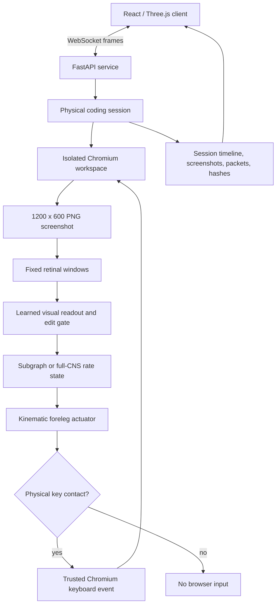

<div align="center">

# FlyLab

**A fly-brain-inspired controller learns to type — one physical keystroke at a time.**

[](https://github.com/Sudharsanselvaraj/Flylab/actions/workflows/verify.yml)
[](LICENSE)
[](services/sim-engine/pyproject.toml)
[](web/app/package.json)
[](https://github.com/Sudharsanselvaraj/Flylab/stargazers)

[**Live showcase**](https://sudharsanselvaraj.github.io/Flylab/) · [Quick start](#quick-start) · [Architecture](#architecture) · [Research status](#research-status) · [Docs](#documentation)

<a href="docs/assets/flylab-demo.mp4">
  
</a>

<sub>Full-CNS coding run · GIF at 2× speed, modeled neural activity · <a href="docs/assets/flylab-demo.mp4">watch full-quality MP4</a></sub>

</div>

<br />

FlyLab is an open-source research prototype built around one narrow, carefully bounded experiment: **can a learned controller, wired into a *Drosophila* connectome-inspired neural simulation, drive a physical fly body to type on a keyboard it can only touch, not query?**

A controller reads real Chromium screenshots, drives a kinematic fly foreleg toward a rendered physical keyboard, and only a *native, contact-gated* Chromium key event reaches the browser. The whole loop runs alongside a synchronized MaleCNS-inspired activity model and a 3D anatomy viewer, with every run archived down to the keystroke.

It is **not** a general coding agent, a claim about biological programming ability, or a validated electrophysiological reconstruction — and it says so, loudly, throughout this repo. See [Research status](#research-status).

<br />

## Table of contents

- [At a glance](#at-a-glance)
- [What FlyLab demonstrates](#what-flylab-demonstrates)
- [Architecture](#architecture)
- [Quick start](#quick-start)
- [Repository layout](#repository-layout)
- [Research status](#research-status)
- [Data and reproducibility](#data-and-reproducibility)
- [Development](#development)
- [Documentation](#documentation)
- [Contributing](#contributing)
- [Citation](#citation)
- [License](#license)

<br />

## At a glance

| | |
|---|---|
| **Connectome scale** | 176,422 cached MaleCNS neuron records · 25,862,574 directed connections |
| **Benchmark** | Single-line HTML headings, fixed layout, contact-gated keystrokes only |
| **Headline trial** | Full-network run: 29 trusted key-down events, 1 self-corrected error, zero final pixel error |
| **Recorded evidence** | Per-session screenshots, timing, neural packets, and replay archives |
| **Stack** | FastAPI + PyTorch/SciPy (sim), React 19 + Three.js + Zustand (client) |
| **Data source** | [MaleCNS](https://male-cns.janelia.org/download/) (Janelia), attribution preserved in generated manifests |

<br />

## What FlyLab demonstrates

- A **contact-gated pipeline**: screenshot → learned controller → foreleg motion → native Chromium key event → new screenshot. No key reaches the browser without a recorded physical contact.
- A **3D workroom** — a seated fly, a physical keyboard, the actual Chromium monitor pixels, and a live MaleCNS activity instrument, all on one shared simulation clock.
- A **whole-CNS view** built from real cached MaleCNS anatomy and connectivity, not a toy or placeholder network.
- **Full provenance**: every run's screenshots, decisions, neural packets, timing, and replay data are archived and inspectable after the fact.
- A **hard trust boundary**: the policy network receives rendered pixels only — never DOM state, target source, task identifiers, or a reward signal. Evaluation inspects the ground truth afterward, from the audit log, not during the run.

<br />

## Architecture

FlyLab keeps the experimental control loop and the presentation layer strictly separate — the browser, controller, motor, and neural state advance on one integer simulation clock; rendering and recording never create scientific events.



| Area | Location | Responsibility |
|---|---|---|
| Browser & keyboard | `services/sim-engine/hawking_fly/physical_coding/browser.py`, `motor.py` | Isolated Chromium workspace, contact-authorized key events |
| Controller | `services/sim-engine/hawking_fly/physical_coding/policy.py` | Learned visual reading, heading transducer, edit decisions |
| Neural runtime | `services/sim-engine/hawking_fly/physical_coding/full_network.py` | Full-CNS rate state and sparse matrix update (native C kernel, SciPy fallback) |
| Session archive | `.../session.py`, `telemetry.py` | Clocked evidence, event packets, replay data |
| API | `services/sim-engine/hawking_fly/api/` | Catalog, anatomy, recordings, session stream, training endpoints |
| Client | `web/app/src/features/coding/` | Desk, seated fly, monitor, instrument, controls, inspector |
| Pipeline scripts | `scripts/` | Data preparation, training, benchmarks, evidence verification |

Full detail in the [architecture guide](docs/architecture.md).

<br />

## Quick start

**Prerequisites:** Python 3.11+, Node.js 22+, Chromium (via Playwright), and prepared FlyLab data caches (see [below](#data-and-reproducibility)).

```sh
git clone https://github.com/Sudharsanselvaraj/Flylab.git flylab
cd flylab

python3.11 -m venv .venv
.venv/bin/python -m pip install --upgrade pip
.venv/bin/python -m pip install -e 'services/sim-engine[dev]'
.venv/bin/python -m playwright install chromium

npm --prefix web/app ci
PYTHONPATH=services/sim-engine .venv/bin/python -m uvicorn hawking_fly.api.app:app --host 127.0.0.1 --port 8050
```

In a second terminal:

```sh
npm --prefix web/app run demo
```

Open **http://localhost:5173**. **Start** runs the heading benchmark, **Brain** opens the whole-CNS viewer, and **Evidence & source** exposes recorded sessions and their provenance.

> Prefer Docker? `docker-compose up sim-engine` builds and runs the simulation service with the same environment.

A static, non-interactive showcase is published at **[sudharsanselvaraj.github.io/Flylab](https://sudharsanselvaraj.github.io/Flylab/)** — GitHub Pages can't host the Python/Chromium/WebSocket stack a live run needs, so use Quick Start above to actually drive the experiment.

<br />

## Repository layout

```
Flylab/
├── services/sim-engine/hawking_fly/
│   ├── api/              # FastAPI + WebSocket endpoints
│   ├── connectome/       # neuPrint client, caching, circuit routes
│   ├── coding/           # controller training/inference
│   └── physical_coding/  # browser control, motor kinematics, full-CNS engine
├── web/app/               # React 19 + Three.js + Zustand client
├── scripts/                # prepare / train / evaluate / benchmark pipeline
├── experiments/
│   ├── physical_coding/   # the typing benchmark — sessions, checkpoints, evidence
│   ├── loom_escape/       # connectome-grounded predator-escape reflex (LC4/LPLC2 → DNp01)
│   ├── live_lif/          # live leaky-integrate-and-fire calibration/decoder
│   └── full_cns/          # full 176k-neuron connectome benchmarks & verification
└── docs/                   # architecture, protocol, honesty policy, history
```

<br />

## Research status

| Layer | Status |
|---|---|
| Anatomy and connectivity | Real cached MaleCNS records and public morphology where available |
| Dynamics | Engineered all-positive, normalized rate model — **not** dynamics-validated |
| Visual input and embodiment | Engineered retinal windows and kinematic contact model |
| Controller | Trained only for the disclosed single-heading curriculum |
| Browser interaction | Native Chromium keyboard events, issued only after recorded physical contact |

The checked-in evidence records a full-network trial with 29 trusted key-down events, one self-corrected error, and zero final pixel error. **That is evidence for this benchmark only** — it does not establish general code synthesis, unseen-layout success, biological causality, or anything about consciousness.

FlyLab keeps a dedicated [honesty policy](docs/honesty-policy.md) governing how results, modeled activity, and the body/brain distinction are described anywhere in the project — including here.

<br />

## Data and reproducibility

Code, trained checkpoints, manifests, and measured evidence are all checked in. Large public anatomy and connectome caches are **intentionally git-ignored** — they're reproducible downloads, never silently swapped for synthetic data.

1. Add a neuPrint token to a local `.env` (never commit it).
2. `PYTHONPATH=services/sim-engine .venv/bin/python scripts/prepare_live_anatomy.py` — builds `data/anatomy/` from MaleCNS records and published skeletons.
3. `.venv/bin/python scripts/prepare_full_cns.py` — fetches and builds the full sparse connection matrices under `data/full_cns/`.
4. *(macOS, optional)* `.venv/bin/python scripts/build_full_cns_native.py` — builds and verifies the parallel CPU kernel; the portable SciPy path works without it.

Source data: the [MaleCNS download portal](https://male-cns.janelia.org/download/). Attribution and licensing metadata are preserved in generated manifests. Exact hashes, evaluation commands, and the full-CNS vs. 677-neuron mode distinction are in the [physical coding protocol](docs/physical-coding.md).

<br />

## Development

```sh
PYTHONPATH=services/sim-engine .venv/bin/python -m pytest services/sim-engine/tests -q
npm --prefix web/app run build
npm --prefix web/app run lint
(cd web/app && npx vitest run)
```

Run these before opening a pull request. Please also read [CONTRIBUTING.md](CONTRIBUTING.md), [SECURITY.md](SECURITY.md), and the [Code of Conduct](CODE_OF_CONDUCT.md).

<br />

## Documentation

| Doc | Covers |
|---|---|
| [Architecture guide](docs/architecture.md) | Source map, trust boundaries, control-loop design |
| [Physical coding protocol](docs/physical-coding.md) | Full method, data model, limitations, evidence hashes |
| [Current implementation state](docs/coding-v2.md) | What's actually shipped right now |
| [Historical token prototype](docs/coding-fly.md) | Earlier, superseded approach |
| [Legacy cleanup record](docs/legacy-cleanup.md) | What was removed and why |
| [Honesty policy](docs/honesty-policy.md) | Labeling rules for modeled vs. real, and result scope |

<br />

## Contributing

Issues and PRs are welcome — see [CONTRIBUTING.md](CONTRIBUTING.md) for setup and conventions, and [SECURITY.md](SECURITY.md) to report vulnerabilities privately. Please review the [Code of Conduct](CODE_OF_CONDUCT.md) before participating.

<br />

## Citation

If FlyLab is useful in your work, please cite it using the metadata in [`CITATION.cff`](CITATION.cff).

<br />

## License

Released under the [MIT License](LICENSE).
