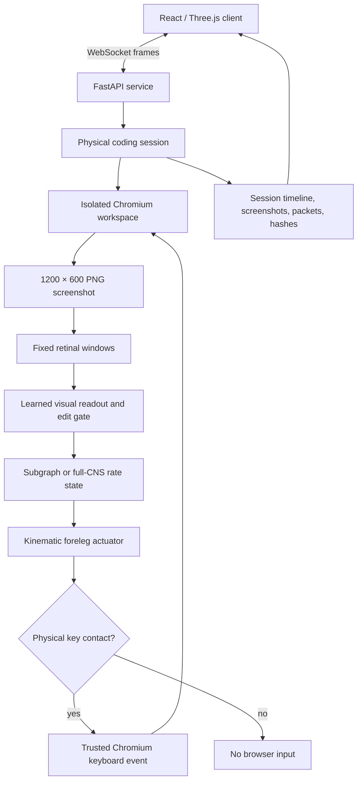

# FlyLab architecture

FlyLab keeps the experimental control loop and the presentation layer separate. The browser, controller, motor, and neural state advance on one integer simulation clock; rendering and recording do not create scientific events.

## Source map

| Area | Location | Responsibility |
| --- | --- | --- |
| Browser and keyboard | `services/sim-engine/hawking_fly/physical_coding/browser.py`, `motor.py` | Isolated Chromium workspace and contact-authorized key events |
| Controller | `services/sim-engine/hawking_fly/physical_coding/policy.py` | Learned visual reading, heading transducer, and edit decisions |
| Neural runtime | `services/sim-engine/hawking_fly/physical_coding/full_network.py` | Full-CNS rate state and sparse matrix update |
| Session archive | `services/sim-engine/hawking_fly/physical_coding/session.py`, `telemetry.py` | Clocked evidence, event packets, and replay data |
| HTTP/WebSocket API | `services/sim-engine/hawking_fly/api/` | Catalog, anatomy, recordings, session stream, and training endpoints |
| Application | `web/app/src/features/coding/` | Desk, seated fly, monitor, instrument, controls, and inspector |
| Preparation and evaluation | `scripts/` | Public-data preparation, training, benchmarks, and evidence verification |

## Trust boundaries

The policy receives rendered pixels; it does not receive target source, DOM state, task identifiers, reward, editor setters, or a direct source-writing API. The evaluator can inspect those values after a run and records them in the audit. This separation is central to the benchmark and should be preserved by changes.

The whole-CNS view uses real cached cell locations when available. Neurons with no published location remain unplaced. Activity colors and threshold events come from the modeled state; no animation should be introduced merely to make the brain look active.
